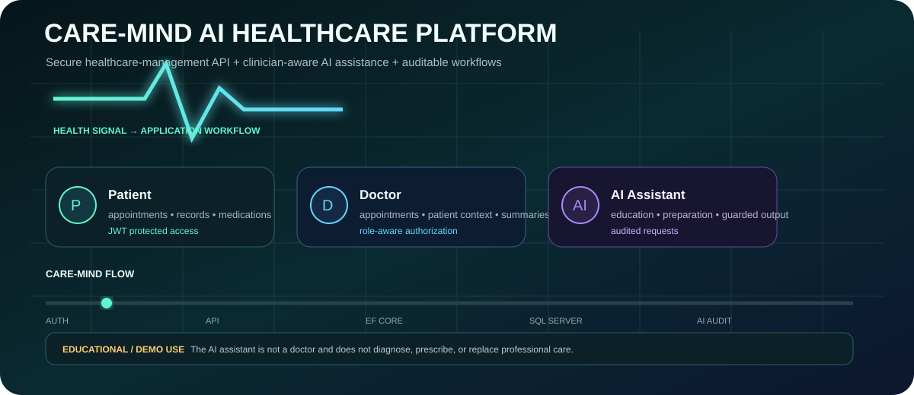
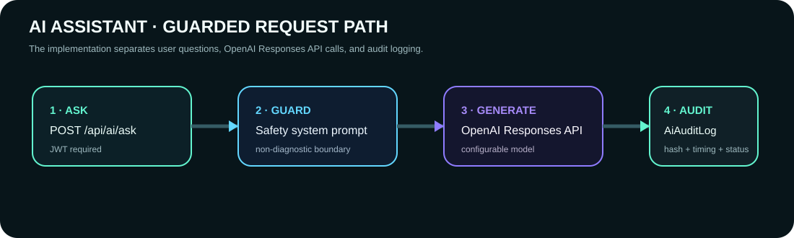
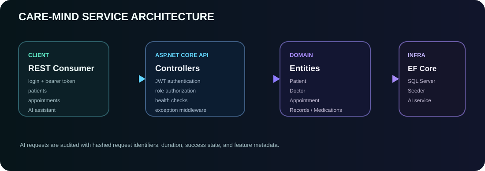

# CARE-MIND AI HEALTHCARE PLATFORM

> ## 🩺 SAFETY DOSSIER
> **.NET 10 · ASP.NET Core Web API · SQL Server · JWT · OpenAI Responses API**
>
> **Scope:** portfolio / educational software  
> **Clinical use:** not appropriate
>
> The README intentionally puts the **safety boundary first**, before the feature tour.



<table>
<tr>
<td><strong>IDENTITY</strong><br/>Admin · Doctor · Patient</td>
<td><strong>CORE DATA</strong><br/>Appointments · Records · Medications</td>
<td><strong>AI GUARDRAIL</strong><br/>Prompt boundary + audit log</td>
<td><strong>OPS</strong><br/>Docker · Health checks · xUnit</td>
</tr>
</table>

---

## A · What is actually implemented?

This repository is a **.NET 10 Web API** organized into API, Domain, and Infrastructure layers. The current codebase includes:

- JWT bearer authentication with **Admin / Doctor / Patient** roles.
- Patient registration and profiles.
- Doctor profiles.
- Appointment creation, listing, authorization-aware filtering, and cancellation.
- Medical records and medications in the domain model.
- SQL Server persistence through **Entity Framework Core 10**.
- Automatic database migration + demo seeding on startup.
- OpenAI **Responses API** integration for health-information questions.
- AI-generated patient visit-preparation summaries for Admin/Doctor users.
- AI audit logging with request hashes, duration, success state, and feature metadata.
- Safe fallback behavior when no OpenAI key is configured.
- Global exception handling.
- Health checks.
- OpenAPI in development.
- Docker Compose for SQL Server.
- xUnit/API tests for health and password hashing.

<p align="center">
  
</p>

## 🧭 Core workflow

```text
             ┌──────────────┐
             │  Authenticate│
             │    /login    │
             └──────┬───────┘
                    │ JWT
                    ▼
        ┌─────────────────────────┐
        │   Role-aware API access │
        └───────┬────────┬────────┘
                │        │
        ┌───────▼───┐ ┌──▼──────────┐
        │  Patient   │ │   Doctor   │
        │ workflows  │ │ workflows  │
        └──────┬─────┘ └──────┬──────┘
               │              │
               └──────┬───────┘
                      ▼
              ┌───────────────┐
              │ Appointments  │
              │ Records       │
              │ Medications   │
              └───────┬───────┘
                      │
          ┌───────────┴───────────┐
          ▼                       ▼
   ┌───────────────┐      ┌────────────────┐
   │ SQL Server    │      │ AI Assistant   │
   │ + EF Core     │      │ OpenAI API     │
   └───────────────┘      └───────┬────────┘
                                  │
                                  ▼
                           ┌──────────────┐
                           │ AI audit log │
                           └──────────────┘
```

## 🏗️ Architecture

<p align="center">
  
</p>

### Solution layers

| Layer | Responsibility |
|---|---|
| `AIHealthCare.Api` | Controllers, authentication, middleware, OpenAPI, health checks |
| `AIHealthCare.Domain` | Entities and enums used by the business model |
| `AIHealthCare.Infrastructure` | EF Core, SQL Server, seeding, OpenAI integration |
| `AIHealthCare.Api.Tests` | API/context and password-hashing tests |

The design is intentionally close to a clean architecture split, with the API depending on Domain and Infrastructure while domain entities remain free of ASP.NET-specific concerns.

## 👥 Role model

| Role | Current access pattern |
|---|---|
| **Admin** | Broad management access |
| **Doctor** | Appointment creation and patient-summary AI workflow |
| **Patient** | Patient-facing appointment access filtered to the current user |
| **Unauthenticated** | Login + health endpoint |

The appointment controller uses the authenticated user's **role + user ID** to filter returned appointments for patients and doctors.

## 📅 Appointment workflow

| Endpoint | Method | Purpose |
|---|---:|---|
| `/api/auth/login` | POST | Validate credentials and issue JWT |
| `/api/health` | GET | Anonymous health response |
| `/api/appointments` | GET | List appointments with role-aware filtering |
| `/api/appointments` | POST | Create an appointment, Admin/Doctor only |
| `/api/appointments/{id}/cancel` | PATCH | Cancel an appointment when authorized |
| `/api/ai/ask` | POST | Ask the guarded AI assistant |
| `/api/ai/patients/{patientId}/summary` | POST | Generate a visit-preparation summary, Admin/Doctor only |

## 🤖 AI layer

The AI integration is deliberately narrower than a generic chatbot.

### `/api/ai/ask`

The application:

1. requires authentication;
2. rejects empty or oversized questions;
3. applies a healthcare safety system prompt;
4. calls the OpenAI Responses API when configured;
5. falls back safely when an API key is absent;
6. writes an `AiAuditLog` entry.

The configured model defaults to `gpt-5.2`, but the implementation reads `OpenAI:Model` from configuration.

### Patient visit summaries

Admins and doctors can request a patient summary built from structured application data:

```text
Patient
 ├── Medical records
 └── Active medications
          │
          ▼
   structured prompt
          │
          ▼
   OpenAI Responses API
          │
          ▼
Known information
Recent records
Current medications
Questions to discuss with a clinician
```

The AI service explicitly instructs the model not to diagnose, infer missing conditions, recommend medication changes, or invent facts.

## 🔐 AI audit trail

Every AI request creates an audit record containing:

- authenticated user ID when available;
- feature name;
- SHA-256 hash of the request identifier;
- response status summary;
- elapsed duration in milliseconds;
- success/failure state;
- creation timestamp.

That gives the platform an observable AI trail without storing the raw user question in the audit row.

## 🗃️ Domain model

```text
AppUser
  ├── Patient
  └── Doctor

Patient
  ├── Appointments
  ├── MedicalRecords
  └── Medications

Doctor
  ├── Appointments
  └── MedicalRecords

Appointment
  ├── Patient
  └── Doctor

AiAuditLog
  └── optional AppUser
```

Core entities:

`AppUser` · `Patient` · `Doctor` · `Appointment` · `MedicalRecord` · `Medication` · `AiAuditLog`

## 🛠️ Technology stack

### Backend

- .NET 10
- ASP.NET Core Web API
- C#
- Entity Framework Core 10
- SQL Server 2022
- JWT Bearer Authentication
- OpenAPI
- Docker Compose
- xUnit v3

### AI

- Official OpenAI .NET SDK
- OpenAI Responses API
- Configurable model
- Safety-oriented system prompt
- Fallback mode without API credentials
- AI request audit logging

### Infrastructure

- EF Core migrations
- Startup database migration
- Demo data seeding
- Global exception middleware
- Health checks
- Central package management

## 📁 Repository structure

```text
CARE-MIND-AI-HEALTHCARE-PLATFORM/
├── AIHealthCareManagementSystem.slnx
├── Directory.Build.props
├── Directory.Packages.props
├── global.json
├── nuget.config
├── docker-compose.yml
├── LICENSE
├── README.md
│
├── assets/
│   ├── care-mind-hero.svg
│   ├── care-mind-architecture.svg
│   └── care-mind-ai-pulse.svg
│
├── src/
│   ├── AIHealthCare.Api/
│   │   ├── Controllers/
│   │   ├── Contracts/
│   │   ├── Middleware/
│   │   ├── Services/
│   │   ├── Program.cs
│   │   └── appsettings*.json
│   │
│   ├── AIHealthCare.Domain/
│   │   ├── Entities/
│   │   └── Enums/
│   │
│   └── AIHealthCare.Infrastructure/
│       ├── Configurations/
│       ├── Data/
│       └── Services/
│
└── tests/
    └── AIHealthCare.Api.Tests/
```

## 🚀 Run locally

### Prerequisites

- .NET SDK **10.0.100** or a compatible 10.0 feature release
- Docker Desktop
- Git

### 1. Clone

```bash
git clone https://github.com/Sai-Srinivas-P/CARE-MIND-AI-HEALTHCARE-PLATFORM.git
cd CARE-MIND-AI-HEALTHCARE-PLATFORM
```

### 2. Start SQL Server

```bash
docker compose up -d sqlserver
```

The Compose file exposes SQL Server on port `1433`.

### 3. Configure secrets

Do **not** put production secrets in source control.

PowerShell:

```powershell
$env:OpenAI__ApiKey="your-api-key"
```

Optional model:

```powershell
$env:OpenAI__Model="gpt-5.2"
```

The repository contains development/demo credentials and a development JWT key for local use. Replace them before any real deployment.

### 4. Restore and run

```bash
dotnet restore
dotnet run --project src/AIHealthCare.Api
```

In development, OpenAPI is exposed at:

```text
https://localhost:7001/openapi/v1.json
```

Health endpoint:

```text
https://localhost:7001/api/health
```

## 🔑 Demo accounts

The seeder creates:

```text
admin@aihealthcare.local
doctor@aihealthcare.local
patient@aihealthcare.local
```

All three use the configured `Seed:DemoPassword`.

Default development value:

```text
ChangeMe123!
```

Change it before any real deployment.

## 🧪 Tests

Run:

```bash
dotnet test
```

Current tests cover:

- API health endpoint success.
- Password hashing / verification round-trip.

This is a baseline, not a complete healthcare application test suite.

High-value future tests include appointment authorization matrices, access-boundary tests, cancellation rules, AI fallback behavior, AI audit logging, database integration tests, concurrency tests, and security testing.

## 🗄️ Database + migrations

The application uses SQL Server through EF Core and calls `Database.MigrateAsync()` during startup before seeding demo data.

Manual migration workflow:

```bash
dotnet tool install --global dotnet-ef

dotnet ef migrations add InitialCreate \
  --project src/AIHealthCare.Infrastructure \
  --startup-project src/AIHealthCare.Api \
  --output-dir Data/Migrations

dotnet ef database update \
  --project src/AIHealthCare.Infrastructure \
  --startup-project src/AIHealthCare.Api
```

## ⚠️ Security and healthcare boundaries

This repository is **not a production-ready clinical system**.

The current source contains explicit development/demo choices:

- a default SQL Server password in configuration/Compose;
- a development JWT signing key in configuration;
- a default demo password;
- no external identity provider or refresh-token rotation;
- no complete healthcare privacy/compliance implementation;
- no clinical safety certification/evaluation for the AI;
- no rate limiting;
- no full BOLA/IDOR threat model;
- no production-grade secret vault integration.

The correct interpretation is **portfolio / educational healthcare API architecture**, not a deployable medical platform.

## 🛡️ Production hardening roadmap

```text
Current demo API
      │
      ▼
External identity + MFA
      │
      ▼
Secret vault + key rotation
      │
      ▼
Encryption + key management
      │
      ▼
Fine-grained authorization / BOLA defenses
      │
      ▼
Audit + consent + retention controls
      │
      ▼
Security testing + threat modeling
      │
      ▼
AI evaluation + prompt-injection defenses
      │
      ▼
Jurisdiction-specific healthcare compliance
```

## 💬 Example requests

### Login

```http
POST /api/auth/login
Content-Type: application/json

{
  "email": "admin@aihealthcare.local",
  "password": "ChangeMe123!"
}
```

### Ask the AI assistant

```http
POST /api/ai/ask
Authorization: Bearer <token>
Content-Type: application/json

{
  "question": "What questions should I prepare for a routine doctor visit?"
}
```

### Create an appointment

```http
POST /api/appointments
Authorization: Bearer <token>
Content-Type: application/json

{
  "patientId": 1,
  "doctorId": 1,
  "scheduledAtUtc": "2026-10-01T10:00:00Z",
  "reason": "Routine follow-up"
}
```

## 🎯 Why this project is interesting

The value is not just “AI + healthcare” as a label. The implementation ties together:

**JWT → role-aware authorization → EF Core domain model → SQL Server → seeded workflows → OpenAI Responses API → AI audit logging → health checks → Docker → tests**

That makes it a useful portfolio project for demonstrating modern .NET API engineering while keeping the AI component behind explicit safety boundaries.

## 📜 License

MIT License. See [`LICENSE`](LICENSE).

## 👤 Author

**Sai-Srinivas-P**  
GitHub: https://github.com/Sai-Srinivas-P

---

<p align="center">
  <strong>🫶 Build safer healthcare software. Keep the human clinician in the loop.</strong>
</p>
